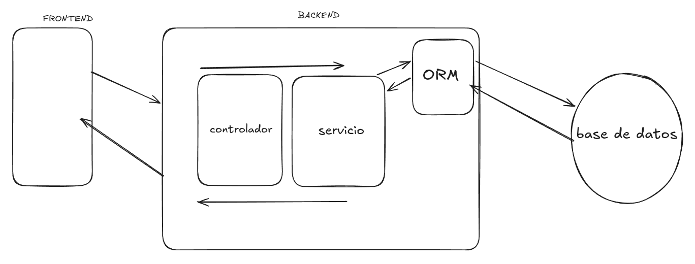

<p align="center">
  <a href="http://nestjs.com/" target="blank"></a>
</p>


## Resumen de la clase

Hoy continuamos con el desarrollo de un servidor backend utilizando **NestJS**, implementando la gestión de usuarios desde un array en memoria (sin base de datos persistente). Vimos los siguientes conceptos clave:

- **Concepto de backend con NestJS**: cómo NestJS permite estructurar aplicaciones backend de manera eficiente y escalable.
- **Service**: su rol como intermediario entre la "base de datos" (en este caso, un array) y el resto de la aplicación. Vimos cómo el Service se vincula tanto con el Controller como con la fuente de datos.
- **Controller**: encargado de recibir las solicitudes HTTP del frontend o de clientes externos y delegar la lógica al Service.
- **Relación entre backend, base de datos y frontend**: cómo fluye la información y responsabilidades de cada capa.

### Imagen explicativa
Durante la clase creamos el siguiente diagrama para visualizar la arquitectura:

---


## Métodos del protocolo HTTP y CRUD

Repasamos los métodos principales del protocolo HTTP y su relación con las operaciones CRUD sobre la base de datos:

- **GET**: Leer datos (Read)
- **POST**: Crear datos (Create)
- **PUT**: Actualizar datos (Update)
- **DELETE**: Eliminar datos (Delete)


Más información: [CRUD: Crear, Leer, Actualizar y Eliminar](https://lab.wallarm.com/what/crud-crear-leer-actualizar-y-eliminar/?lang=es)

## Decoradores en NestJS

Utilizamos los siguientes decoradores para definir rutas y manejar datos:

- `@Controller`: Define el controlador y la ruta base.
- `@Get`: Maneja solicitudes GET.
- `@Post`: Maneja solicitudes POST.
- `@Put`: Maneja solicitudes PUT.
- `@Delete`: Maneja solicitudes DELETE.
- `@Body`: Extrae el cuerpo de la solicitud (usado en POST y PUT).
- `@Param`: Extrae parámetros de la ruta (usado en PUT y DELETE, por ejemplo para identificar el usuario a modificar o eliminar).

## Herramientas para consultas de API (API Clients)

Para probar y consumir APIs, existen varias herramientas conocidas:

- [Postman](https://www.postman.com/)
- [RapidAPI Client](https://rapidapi.com/tools/client)
- [Insomnia](https://insomnia.rest/)
- [Hoppscotch](https://hoppscotch.io/)

Estas herramientas permiten enviar solicitudes HTTP a tu servidor y ver las respuestas, facilitando el desarrollo y testing de APIs.

---

## Tarea

Replicar lo realizado en clase y **completar los métodos DELETE y PUT** para el manejo de usuarios.

### Explicación orientativa

Supongamos que tienes un array de usuarios y quieres implementar los métodos para eliminar y actualizar un usuario por su id:

#### DELETE

```typescript
@Delete(':id')
remove(@Param('id') id: number) {
  // Lógica para eliminar el usuario con ese id
}
```

#### PUT

```typescript
@Put(':id')
update(@Param('id') id: number, @Body() updateUser: User) {
  // Lógica para actualizar el usuario con ese id
}
```

**@Param** permite extraer el parámetro `id` de la URL, por ejemplo `/usuarios/3`.

**Tip:** Recuerda validar que el usuario exista antes de eliminarlo o actualizarlo.

---

## Project setup

```bash
$ npm install
```

## Compile and run the project

```bash
# development
$ npm run start

# watch mode
$ npm run start:dev

# production mode
$ npm run start:prod
```

# Conexión con base de datos a través de ORM

En esta clase avanzamos en la arquitectura de nuestro backend, migrando de un array en memoria a una base de datos real utilizando un **ORM (Object-Relational Mapping)**. Utilizamos **TypeORM** junto a **MySQL** y profundizamos en conceptos clave de NestJS y la programación orientada a servicios.

---

## 1. Inyección de dependencias, @Injectable y Singleton en NestJS

- **@Injectable**: Decorador que marca una clase como inyectable, permitiendo que NestJS gestione su ciclo de vida y la provea donde sea requerida.
- **Inyección de dependencias**: Patrón que permite desacoplar componentes, facilitando la reutilización y el testing. Los servicios y repositorios se inyectan en los controladores o en otros servicios.
- **Singleton**: Por defecto, los providers en NestJS son singletons, es decir, se crea una única instancia para toda la aplicación.

Ejemplo:
```typescript
@Injectable()
export class UsersService {
  // ...
}
```

---

## 2. Integración de TypeORM y MySQL

Migramos la gestión de usuarios a una base de datos MySQL usando TypeORM. Ahora la entidad `User` es una tabla y usamos el repositorio de TypeORM para acceder y modificar los datos.

- Se creó la entidad `User`.
- Se configuró la conexión a MySQL en el módulo principal.
- Se reemplazó el array por el repositorio de TypeORM.

### Diagrama de arquitectura con ORM



---

## 3. Documentación oficial y recursos

- [NestJS: Database](https://docs.nestjs.com/techniques/database)
- [TypeORM: Repository Methods](https://typeorm.io/docs/data-source/null-and-undefined-handling#repository-methods)

---

## 4. Métodos del repositorio y asincronía

Los métodos del repositorio de TypeORM (ver [#sym:Repository](#sym:Repository)) son **asíncronos** y devuelven una **Promise**. Por eso, usamos `async/await` para esperar los resultados de las operaciones sobre la base de datos.

Ejemplo:
```typescript
async findAll(): Promise<User[]> {
  return await this.userRepository.find();
}
```
- **Promise**: Representa un valor que estará disponible en el futuro.
- **async/await**: Permite escribir código asíncrono de forma secuencial y legible.

---

## 5. Utilización de Perplexity para búsquedas con IA

Durante la clase utilizamos [Perplexity](https://www.perplexity.ai/) para realizar búsquedas y consultas rápidas con inteligencia artificial, facilitando la investigación y el aprendizaje de nuevas tecnologías.

---

## 6. Ejemplos prácticos para PUT y DELETE usando TypeORM

A continuación, ejemplos para completar los métodos `PUT` y `DELETE` en el controller usando TypeORM:

### DELETE
```typescript
@Delete(':id')
async remove(@Param('id') id: number): Promise<void> {
  const result = await this.userRepository.delete(id);
  if (result.affected === 0) {
    throw new NotFoundException(`Usuario con id ${id} no encontrado`);
  }
}
```

### PUT
```typescript
@Put(':id')
async update(@Param('id') id: number, @Body() updateUser: User): Promise<User> {
  await this.userRepository.update(id, updateUser);
  const updatedUser = await this.userRepository.findOneBy({ id });
  if (!updatedUser) {
    throw new NotFoundException(`Usuario con id ${id} no encontrado`);
  }
  return updatedUser;
}
```
> **Tip:** Validar siempre que el usuario exista antes de actualizar o eliminar, y manejar los posibles errores usando excepciones de NestJS como `NotFoundException`.

---

## 7. Resumen de la clase

- Migramos de un array en memoria a una base de datos real usando ORM.
- Aprendimos sobre inyección de dependencias, @Injectable y el patrón singleton en NestJS.
- Usamos métodos asíncronos y el patrón async/await para interactuar con la base de datos.
- Consultamos documentación oficial y utilizamos IA para investigar.
- Practicamos la implementación de métodos PUT y DELETE con TypeORM.


