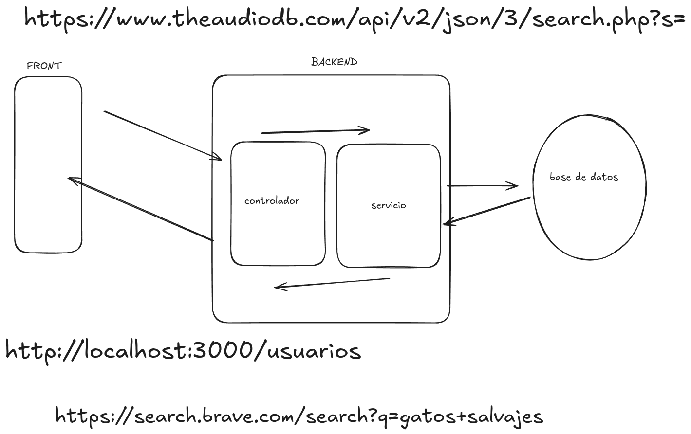

<p align="center">
  <a href="http://nestjs.com/" target="blank"></a>
</p>


## Resumen de la clase

Hoy continuamos con el desarrollo de un servidor backend utilizando **NestJS**, implementando la gestión de usuarios desde un array en memoria (sin base de datos persistente). Vimos los siguientes conceptos clave:

- **Concepto de backend con NestJS**: cómo NestJS permite estructurar aplicaciones backend de manera eficiente y escalable.
- **Service**: su rol como intermediario entre la "base de datos" (en este caso, un array) y el resto de la aplicación. Vimos cómo el Service se vincula tanto con el Controller como con la fuente de datos.
- **Controller**: encargado de recibir las solicitudes HTTP del frontend o de clientes externos y delegar la lógica al Service.
- **Relación entre backend, base de datos y frontend**: cómo fluye la información y responsabilidades de cada capa.

### Imagen explicativa
Durante la clase creamos el siguiente diagrama para visualizar la arquitectura:

---



## Métodos del protocolo HTTP y CRUD

Repasamos los métodos principales del protocolo HTTP y su relación con las operaciones CRUD sobre la base de datos:

- **GET**: Leer datos (Read)
- **POST**: Crear datos (Create)
- **PUT**: Actualizar datos (Update)
- **DELETE**: Eliminar datos (Delete)


Más información: [CRUD: Crear, Leer, Actualizar y Eliminar](https://lab.wallarm.com/what/crud-crear-leer-actualizar-y-eliminar/?lang=es)

## Decoradores en NestJS

Utilizamos los siguientes decoradores para definir rutas y manejar datos:

- `@Controller`: Define el controlador y la ruta base.
- `@Get`: Maneja solicitudes GET.
- `@Post`: Maneja solicitudes POST.
- `@Put`: Maneja solicitudes PUT.
- `@Delete`: Maneja solicitudes DELETE.
- `@Body`: Extrae el cuerpo de la solicitud (usado en POST y PUT).
- `@Param`: Extrae parámetros de la ruta (usado en PUT y DELETE, por ejemplo para identificar el usuario a modificar o eliminar).

## Herramientas para consultas de API (API Clients)

Para probar y consumir APIs, existen varias herramientas conocidas:

- [Postman](https://www.postman.com/)
- [RapidAPI Client](https://rapidapi.com/tools/client)
- [Insomnia](https://insomnia.rest/)
- [Hoppscotch](https://hoppscotch.io/)

Estas herramientas permiten enviar solicitudes HTTP a tu servidor y ver las respuestas, facilitando el desarrollo y testing de APIs.

---

## Tarea

Replicar lo realizado en clase y **completar los métodos DELETE y PUT** para el manejo de usuarios.

### Explicación orientativa

Supongamos que tienes un array de usuarios y quieres implementar los métodos para eliminar y actualizar un usuario por su id:

#### DELETE

```typescript
@Delete(':id')
remove(@Param('id') id: number) {
  // Lógica para eliminar el usuario con ese id
}
```

#### PUT

```typescript
@Put(':id')
update(@Param('id') id: number, @Body() updateUser: User) {
  // Lógica para actualizar el usuario con ese id
}
```

**@Param** permite extraer el parámetro `id` de la URL, por ejemplo `/usuarios/3`.

**Tip:** Recuerda validar que el usuario exista antes de eliminarlo o actualizarlo.

---

## Project setup

```bash
$ npm install
```

## Compile and run the project

```bash
# development
$ npm run start

# watch mode
$ npm run start:dev

# production mode
$ npm run start:prod
```


